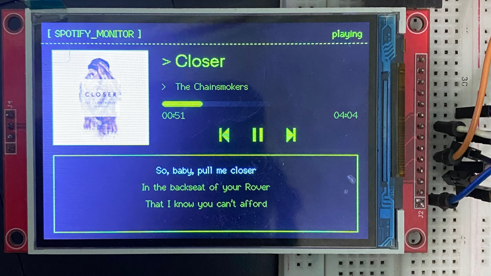
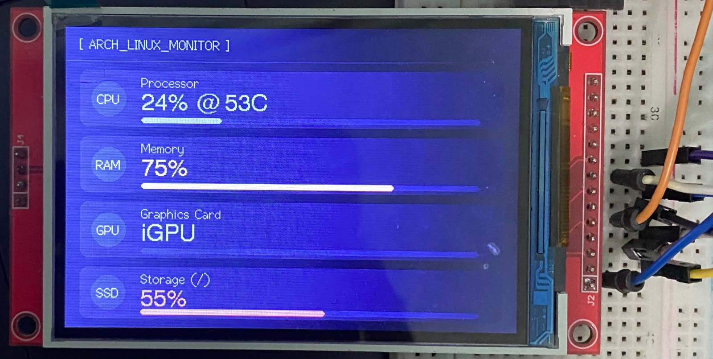
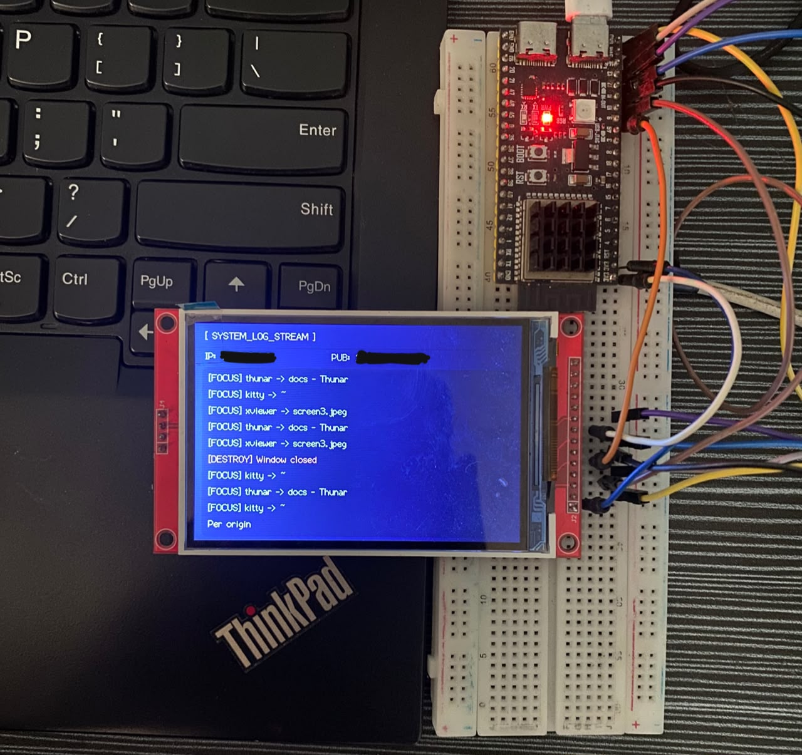

# ESP32-S3 Smart Desk Display

**Spotify • System Monitor • ESP32 Status • Hyprland Logs**

A custom **3.5-inch secondary display** powered by an **ESP32-S3** and an **ILI9488 TFT LCD**, connected to a Linux PC via USB.

The display provides real-time information from the host PC, including Spotify playback, system resource usage, ESP32 diagnostics, and Hyprland desktop activity.

The project is built using **ESP-IDF (C++)** for the ESP32 firmware and **Python** for the host-side application.

---

## ✨ Features

### 🎵 Page 1 · Spotify Monitor

Displays real-time music information from Spotify:

- Album artwork
- Song title
- Artist name
- Playback progress
- Current playback time
- Total track duration
- Time-synchronized lyrics
- Automatic album artwork transfer to the ESP32

Lyrics are retrieved from the **LRCLIB API** and synchronized with the current playback position.

---

### 📊 Page 2 · System Monitor

Displays real-time system information from the Linux host:

- CPU usage
- RAM usage
- Disk usage
- CPU temperature
- GPU temperature
- Color-coded temperature warnings

System information is collected using Python and `psutil`.

---

### ⚙️ Page 3 · ESP32 Status

Displays internal ESP32 system information:

- Free heap memory
- PSRAM usage
- FreeRTOS task information
- Core 0 activity
- Core 1 activity
- Task distribution between CPU cores

The ESP32 uses its dual-core architecture to separate communication and UI rendering.

---

### 🖥️ Page 4 · System & Hyprland Logs

Displays useful desktop and system activity in real time.

Includes:

- Filtered `journalctl` logs
- Hyprland window events
- Application open/close events
- Workspace switching
- Desktop activity
- Local IP address
- Public IP address

Network and VPN-related spam can be filtered to keep the log display readable.

---

# 🛠️ Hardware Requirements

| Component | Specification |
|---|---|
| Microcontroller | ESP32-S3 DevKit |
| PSRAM | At least 8 MB Octal PSRAM recommended |
| Display | 3.5" ILI9488 TFT LCD |
| Resolution | 480 × 320 |
| Interface | SPI |
| Touch | Non-Touch |
| Connection | USB |
| Wiring | Dupont jumper wires |

---

# 📌 Wiring

## ESP32-S3 ↔ ILI9488

Keep SPI wires as short as possible to maintain a stable **40 MHz SPI signal**.

| ILI9488 Pin | ESP32-S3 GPIO | Description |
|---|---:|---|
| VCC | 3.3V | LCD power |
| LED | 3.3V / 5V | Backlight* |
| GND | GND | Ground |
| CS | GPIO 10 | Chip Select |
| DC / RS | GPIO 9 | Data / Command |
| RST / RES | GPIO 14 | Reset |
| SDI / MOSI | GPIO 11 | SPI Master Out |
| SCK / CLK | GPIO 12 | SPI Clock |
| SDO / MISO | GPIO 13 | SPI Master In |

> **Note:** Backlight voltage depends on the specific ILI9488 module. Check your display board before connecting `LED` directly to 5V.

---

# 💻 Software Requirements

## ESP32

- ESP-IDF v6
- C++
- LovyanGFX
- FreeRTOS

## Host PC

- Linux
- Python 3
- `playerctl`
- `psutil`
- `git`
- Hyprland
- `journalctl`

The host application is currently designed and tested on:

**Arch Linux + Hyprland**

---

# 📦 Installation

## 1. Install Host Dependencies

On Arch Linux:

```bash
sudo pacman -S python python-pip git playerctl
```

Create a Python virtual environment:

```bash
python -m venv venv
```

Activate it:

```bash
source venv/bin/activate
```

Install Python dependencies:

```bash
pip install -r requirements.txt
```

---

# 📥 Clone the Repository

```bash
git clone https://github.com/cabxxx21/esp32-s3-smart-display.git
```

Enter the project directory:

```bash
cd esp32-s3-smart-display
```

Set up the Python environment:

```bash
python -m venv venv
source venv/bin/activate
pip install -r requirements.txt
```

---

# 🚀 Usage

## Step 1 · Flash the ESP32 Firmware

Open the firmware project in **VS Code** with the ESP-IDF extension installed.

Set the target chip to:

```text
esp32s3
```

Then build and flash the firmware.

Using ESP-IDF commands:

```bash
idf.py set-target esp32s3
idf.py build
idf.py flash
```

To open the serial monitor:

```bash
idf.py monitor
```

Or use **Flash and Monitor** directly from the ESP-IDF extension in VS Code.

---

## Step 2 · Connect the ESP32

Connect the ESP32-S3 to the Linux PC using USB.

The ESP32 communicates with the host application through **USB CDC Serial**.

Make sure the device is detected by Linux before starting the host application.

---

## Step 3 · Run the Host Application

Activate the Python environment:

```bash
source venv/bin/activate
```

Run:

```bash
python monitor.py
```

The host application will begin collecting system, Spotify, and Hyprland information and send it to the ESP32.

---

# ⌨️ Navigation

While `monitor.py` is running, use the following keyboard shortcuts:

| Key | Function |
|---|---|
| `1` | Spotify Monitor |
| `2` | System Monitor |
| `3` | ESP32 Status |
| `4` | System & Hyprland Logs |
| `q` | Quit |

---

# 🏗️ System Architecture

```text
                    ┌──────────────────────────┐
                    │        Linux PC          │
                    │      Arch + Hyprland     │
                    └────────────┬─────────────┘
                                 │
                                 │ Python
                                 ▼
                    ┌──────────────────────────┐
                    │      Host Application    │
                    │       monitor.py         │
                    ├──────────────────────────┤
                    │ psutil                   │
                    │ playerctl                │
                    │ LRCLIB API               │
                    │ journalctl               │
                    │ Hyprland socket2.sock    │
                    └────────────┬─────────────┘
                                 │
                                 │ USB CDC Serial
                                 ▼
                    ┌──────────────────────────┐
                    │        ESP32-S3          │
                    ├──────────────────────────┤
                    │      serial_task         │
                    │         Core 0           │
                    ├──────────────────────────┤
                    │        ui_task           │
                    │         Core 1           │
                    └────────────┬─────────────┘
                                 │
                                 │ SPI
                                 ▼
                    ┌──────────────────────────┐
                    │      ILI9488 TFT         │
                    │        480 × 320         │
                    └──────────────────────────┘
```

---

# ⚙️ Firmware Architecture

The ESP32 firmware uses the ESP32-S3's dual-core architecture to separate communication processing from UI rendering.

### Core 0 · `serial_task`

Responsible for:

- Receiving USB serial data
- Parsing incoming packets
- Processing commands
- Receiving album artwork
- Updating shared application data

### Core 1 · `ui_task`

Responsible for:

- Rendering the LCD interface
- Updating page contents
- Drawing progress bars
- Rendering text and images
- Updating the display at a consistent refresh rate

This separation helps prevent incoming serial data from blocking UI rendering.

---

# 🎨 Display Rendering

The UI uses **LovyanGFX** for graphics rendering.

To reduce flickering, the project uses **double buffering** with sprites allocated in PSRAM.

```text
Application Data
       │
       ▼
   UI Rendering
       │
       ▼
  PSRAM Sprite
       │
       ▼
    ILI9488
```

The display is rendered into an off-screen buffer before being pushed to the LCD.

This provides smoother UI updates compared to directly drawing every element onto the display.

---

# 🐍 Host Application

The Python application acts as the bridge between the Linux desktop and the ESP32.

### System Monitoring

Uses:

```text
psutil
```

to collect:

- CPU usage
- Memory usage
- Disk usage
- Temperature information

---

### Spotify Monitoring

Uses:

```text
playerctl
```

to retrieve:

- Track title
- Artist
- Playback status
- Current position
- Track duration
- Album information

---

### Synchronized Lyrics

Lyrics are retrieved through:

```text
LRCLIB
```

The host application matches lyric timestamps with the current playback position and sends the appropriate lyric data to the ESP32.

---

### Hyprland Events

Hyprland activity is monitored through:

```text
socket2.sock
```

This allows the display to react to desktop events such as:

```text
Window opened
Window closed
Workspace changed
Application switched
```

---

### System Logs

System activity is collected through:

```bash
journalctl
```

Relevant log entries are filtered before being sent to the display to avoid flooding the LCD with unnecessary network, VPN, and background service messages.

---

# 📡 Serial Communication

The host PC and ESP32 communicate using a lightweight text-based protocol.

Messages are identified using prefixes.

Example:

```text
MUS:
SYS:
LOG:
LYR:
IMG:
```

### Protocol Overview

| Prefix | Purpose |
|---|---|
| `MUS:` | Spotify / music information |
| `SYS:` | System statistics |
| `LOG:` | System & Hyprland logs |
| `LYR:` | Synchronized lyrics |
| `IMG:` | Album artwork |

Album artwork is resized by the Python application before being transferred to the ESP32.

Image data is transmitted in **1024-byte chunks** to reduce memory and communication overhead.

---

# 🧠 Memory & Performance

The ESP32-S3 uses both internal RAM and PSRAM.

PSRAM is primarily used for large graphics buffers and image data, allowing the application to maintain a responsive UI without consuming excessive internal heap memory.

The firmware also monitors its own memory usage and FreeRTOS task distribution, which is displayed on the ESP32 Status page.

---

# 📂 Project Structure

```text
esp32-s3-smart-display/
│
├── firmware/
│   ├── main/
│   ├── components/
│   ├── CMakeLists.txt
│   └── sdkconfig
│
├── host/
│   ├── monitor.py
│   ├── requirements.txt
│   └── ...
│
├── docs/
│   ├── screen1.jpeg
│   ├── screen2.jpeg
│   └── screen3.jpeg
│
├── README.md
├── LICENSE
└── requirements.txt
```

> The exact project structure may change as development continues.

---

# 📷  A realtime world camera capture XD

### Page 1 · Spotify Monitor



### Page 2 · System Monitor



### Page 3 · System & Hyprland Logs



---

# 🔧 Development

This project is primarily developed for **Linux + Hyprland**, but the architecture may be adapted to other desktop environments.

The ESP32 firmware is developed using:

```text
ESP-IDF
C++
FreeRTOS
LovyanGFX
```

The host software uses:

```text
Python
psutil
playerctl
subprocess
Hyprland IPC
LRCLIB API
```

---

# 📝 Notes

- The project currently targets **Linux systems using Hyprland**.
- Some system-monitoring features may require adaptation for other Linux distributions or desktop environments.
- GPU temperature monitoring depends on the available hardware and Linux sensor interfaces.
- Spotify monitoring requires a compatible `playerctl` player interface.
- Hyprland-specific functionality will not work on non-Hyprland desktop environments without modification.
- The ILI9488 SPI connection should use short wires for reliable high-speed communication.

---

# 📜 License

This project is licensed under the **MIT License**.

See the [`LICENSE`](LICENSE) file for details.

---

# 👤 Author

**Rafi**

Engineering / Embedded Systems Project

Built with:

```text
ESP32-S3
ILI9488
ESP-IDF
C++
Python
Linux
Hyprland
```
